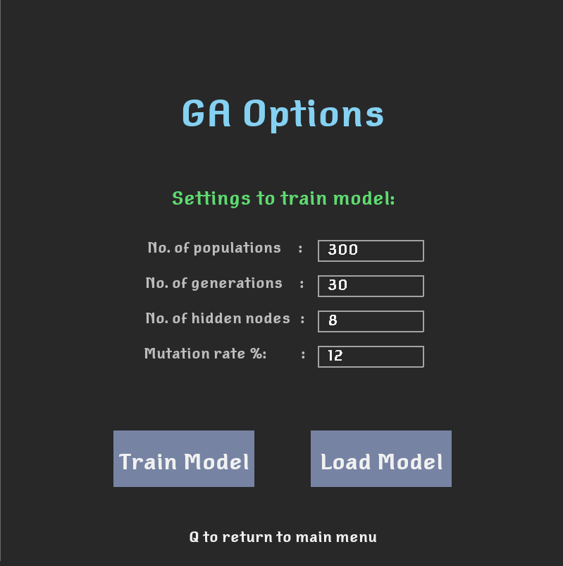
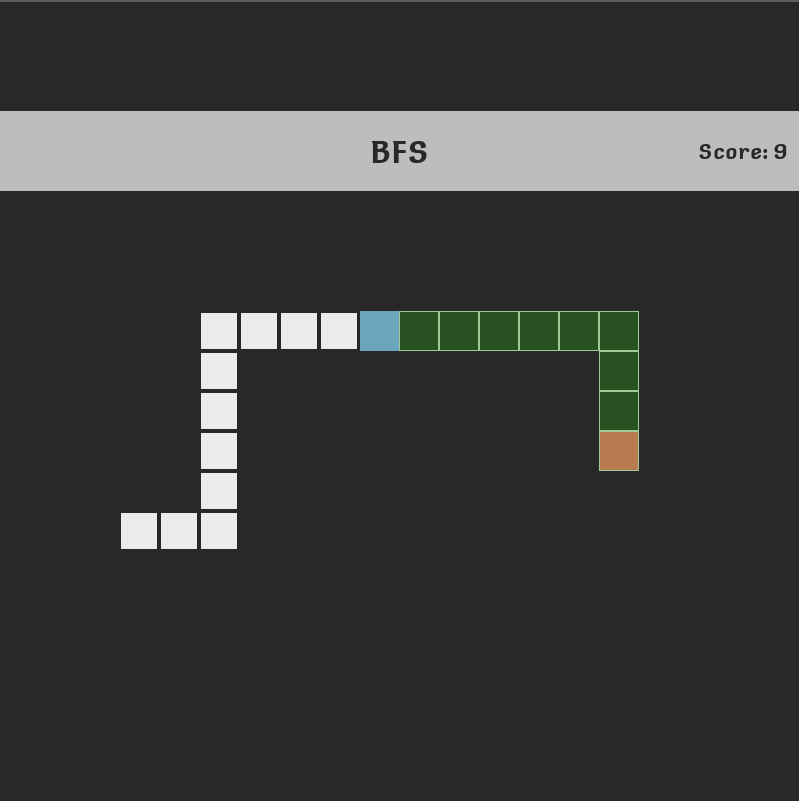
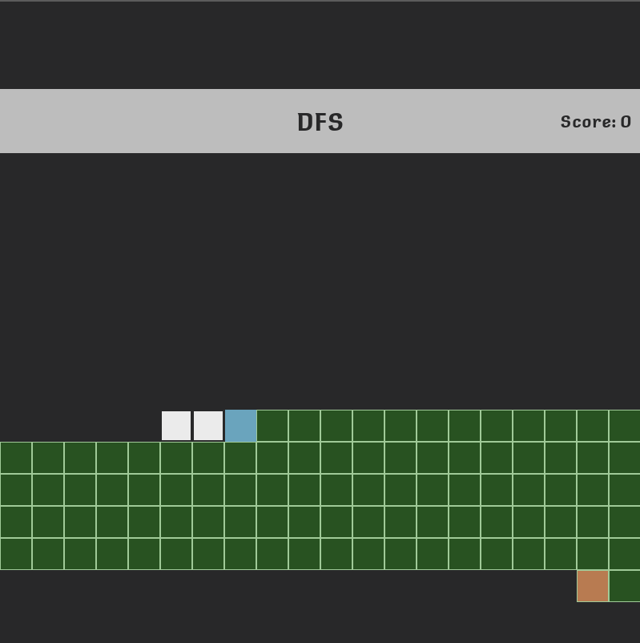

# Requirements
you'll need to install:
* pygame==2.0.1 
* numpy==1.18.5
# About 
Used for educational purposes, show cases different path finding Ai and a genetic algorithm using neural networks.  
These algorithms are evaluated under the same fruit spawn seed.
This project does not aim to create the perfect Ai snake, only vanilla path finding algorithms are used and a simple neural network.   
 preview: https://youtu.be/AEQMAnJ5iP4

# what to expect
Main.py runs the program.

## 1) Genetic algorithm using neural networks
* train your own neural network with the given parameters 
* save the trained model and load it.
* within the code you can change seeds and activation functions.

  

## 2) path finding Ai
Currently only 3 path finding algorithms are available
You can preview the calculated path for the given algorithm.

  
  
  
  

