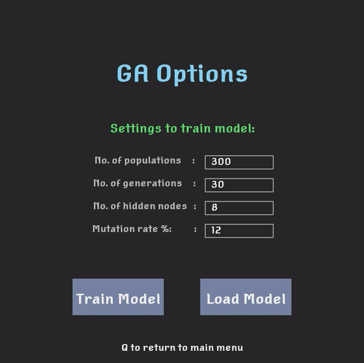
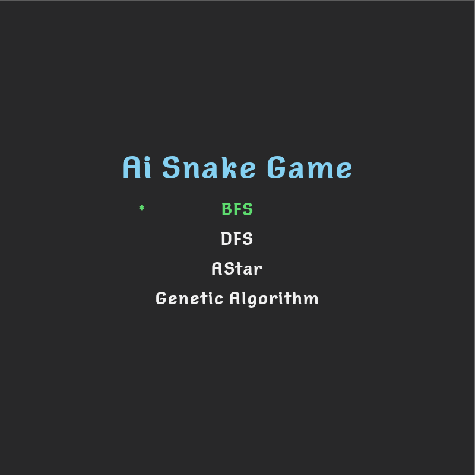
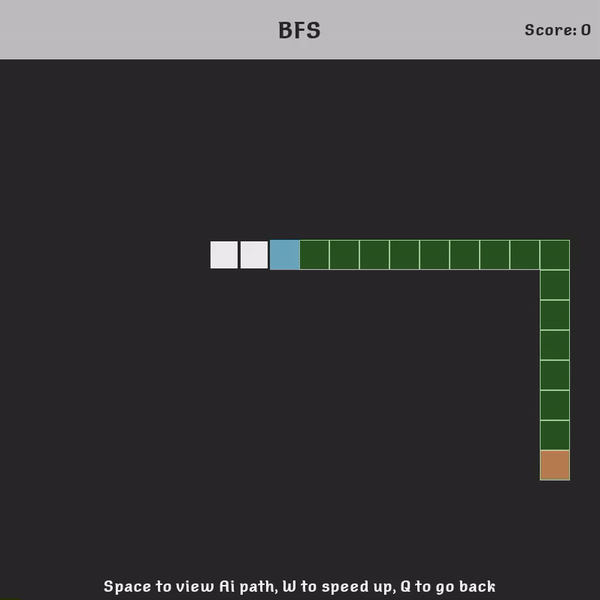
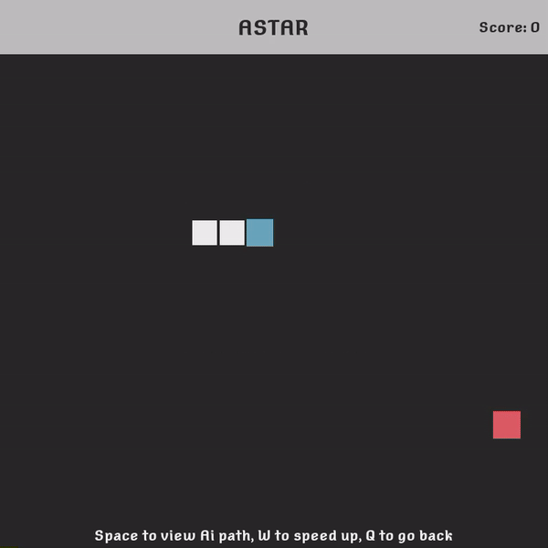
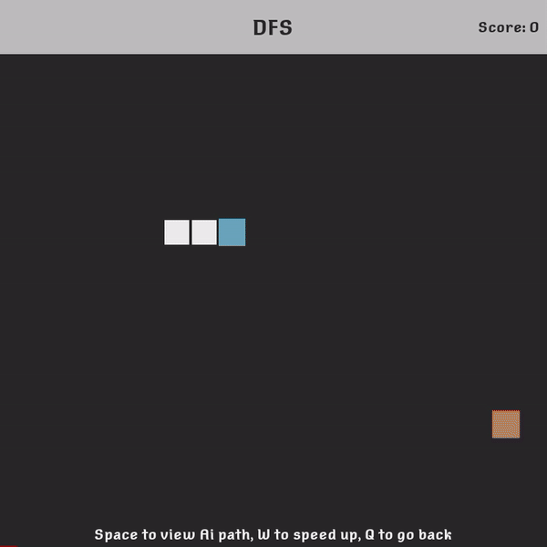

# Requirements

you'll need to install:

- pygame==2.0.1
- numpy

# About

Used for educational purposes, show cases different path finding Ai and a genetic algorithm using neural networks.  
These algorithms are evaluated under the same fruit seed spawn.
This project does not aim to create the perfect Ai snake, only vanilla path finding algorithms are used and a simple neural network.  
[preview](https://www.youtube.com/watch?v=AEQMAnJ5iP4)

# what to expect

Main.py runs the program.

## 1) Genetic algorithm using neural networks

- train your own neural network by changing the given parameter values.
- save the trained model and load it.

  
  

## 2) path finding Ai

Currently only 3 path finding algorithms are available
You can preview the calculated path for the given algorithm.

  
  
  
  

